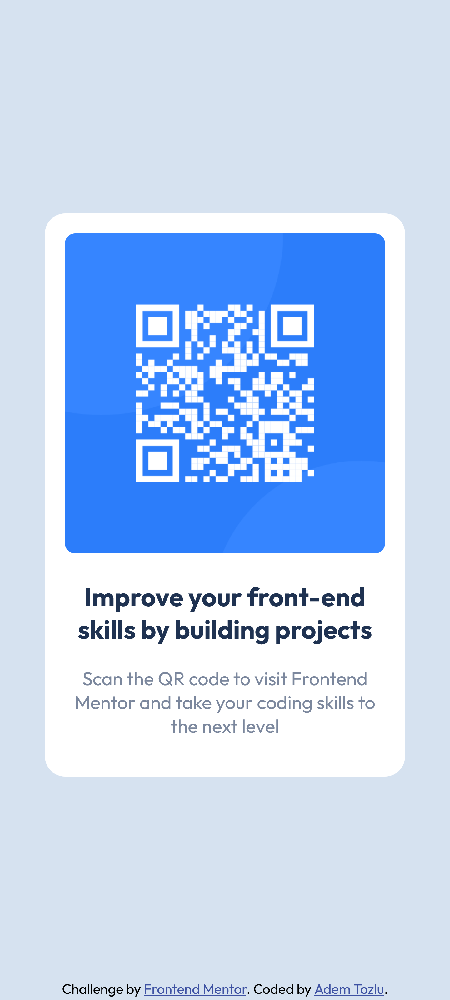

# Frontend Mentor – QR-Code-Komponentenlösung

Dies ist eine Lösung für die [QR-Code-Komponenten-Herausforderung auf Frontend Mentor](https://www.frontendmentor.io/challenges/qr-code-component-iux_sIO_H). Frontend-Mentor-Herausforderungen helfen Ihnen, Ihre Programmierfähigkeiten zu verbessern, indem Sie realistische Projekte erstellen.

## Inhaltsverzeichnis

- [Übersicht](#Übersicht)
  - [Screenshot](#screenshot)
  - [Links](#links)
- [Mein Prozess](#my-process)
  - [Erstellt mit](#built-with)
  - [Was ich gelernt habe](#what-i-learned)
  - [Fortsetzung der Entwicklung](#continued-development)
- [Autor](#Autor)

## Überblick

### Bildschirmfoto

### Links

- Lösungs-URL: [Github-Lösungen](https://github.com/Adem-Tozlu/Frontend-Mentor-QR-Code)
- Live-Site-URL: [Website-QR-Code](https://frontend-mentor-qr-code-drab-ten.vercel.app/)

## Mein Prozess

### Gebaut mit

- Semantisches HTML5-Markup
- Benutzerdefinierte CSS-Eigenschaften
- Flexbox
- Mobile-First-Workflow

### Was ich gelernt habe

Im Laufe dieses Projekts habe ich mich in Flexbox weiter verbessert. Ich habe gelernt, es effektiv zu nutzen. Außerdem habe ich meine technischen Fähigkeiten erweitert. Darüber hinaus habe ich gelernt, Feedback zu geben und zu erhalten, was für meine persönliche und berufliche Entwicklung sehr wertvoll war.

### Weiterentwicklung

In Zukunft plane ich, meine Fähigkeiten im CSS-Bereich weiter zu verbessern, insbesondere im Zusammenhang mit Flexbox und Grid. Mein Ziel ist es, komplexere Websites zu erstellen und diese besser zu gestalten. Darüber hinaus möchte ich auch an meinen Fähigkeiten im Erstellen von Animationen arbeiten und mich in diesem Bereich weiterentwickeln!

##Autor

- Website - [Github](https://github.com/Adem-Tozlu)
- Frontend-Mentor – [@Adem-Tozlu](https://www.frontendmentor.io/profile/Adem-Tozlu)
- Linkedin - [@Adem-Tozlu](https://www.linkedin.com/in/adem-tozlu-8906b52a5)