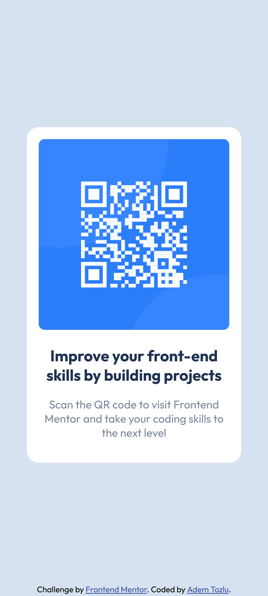

# Frontend Mentor - QR code component solution

This is a solution to the [QR code component challenge on Frontend Mentor](https://www.frontendmentor.io/challenges/qr-code-component-iux_sIO_H). Frontend Mentor challenges help you improve your coding skills by building realistic projects. 

## Table of contents

- [Overview](#overview)
  - [Screenshot](#screenshot)
  - [Links](#links)
- [My process](#my-process)
  - [Built with](#built-with)
  - [What I learned](#what-i-learned)
  - [Continued development](#continued-development)
- [Author](#author)

## Overview

### Screenshot

### Links

- Solution URL: [Add solution URL here](https://your-solution-url.com)
- Live Site URL: [Add live site URL here](https://your-live-site-url.com)

## My process

### Built with

- Semantic HTML5 markup
- CSS custom properties
- Flexbox
- Mobile-first workflow

### What I learned

Over the course of this project I continued to improve in Flexbox. I learned how to use it effectively. I also expanded my technical skills. Additionally, I learned how to give and receive feedback, which was very valuable for my personal and professional development.

### Continued development

In der Zukunft plane ich, meine Fähigkeiten im CSS-Bereich weiter zu verbessern, insbesondere in Bezug auf Flexbox und Grid. Mein Ziel ist es, komplexere Webseiten zu erstellen und sie besser zu gestalten. Darüber hinaus möchte ich auch an meinen Fähigkeiten in der Erstellung von Animationen arbeiten und mich in diesem Bereich weiterentwickeln!

In the future, I plan to continue improving my skills in the CSS area, especially related to Flexbox and Grid. My goal is to create more complex websites and design them better. In addition, I would also like to work on my skills in creating animations and develop myself further in this area!

## Author

- Website - [Github](https://github.com/Adem-Tozlu/Frontend-Mentor-QR-Code)
- Frontend Mentor - [@Adem-Tozlu](https://www.frontendmentor.io/profile/Adem-Tozlu)

